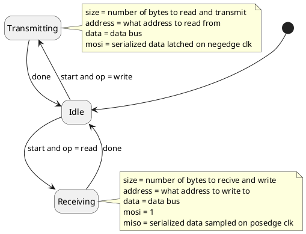
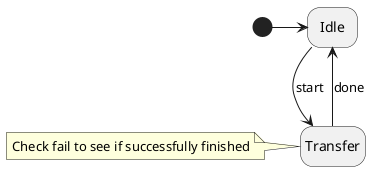
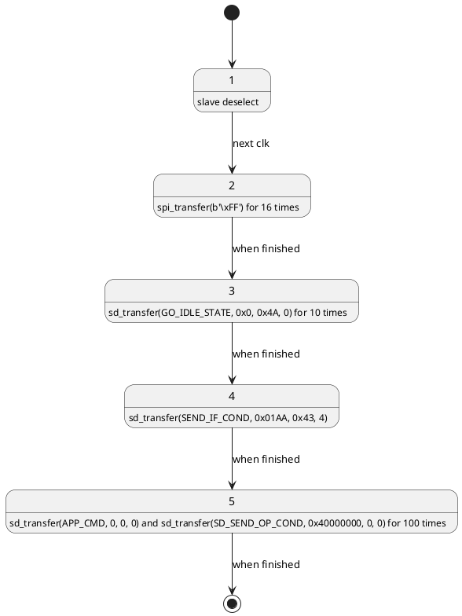
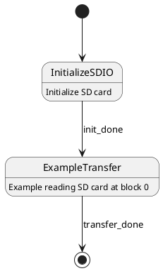

# SPI Controller

## Description
- Byte-Oriented half-duplex master SPI controller
- Slave select is left for higher layers
- Reading and writing to external memory (wrap in a register pseudo-memory if needed)

## Ports
- `output mosi` SPI
- `input miso` SPI
- `output clk_out` SPI clock
- `input clk` module clock
- `inout data` 8-bit data bus
- `input op`
  - 0: read
  - 1: write
- `input start` initiate transfer
- `output address` n-bit address bus 0-indexed (read or write)
- `input size` number of bytes in next transfer (read or write)
- `output done` = 1 when in `Idle` sate, 0 otherwise

## FSM

# SDIO Controller

## Description

- SDIO controller using SPI bus
- Uses SPI controller
- Reading and writing to external memory
  - If you need reading SD card use at least 512 byte external memory
  - Need at least 1 byte more for internal use
- `sd_transfer(cmd, arg, crc, nresponse)`
  - `cmd` = a valid SD command
  - `arg` = argument
  - `crc` = CRC of the SD frame
  - `nresponse` = number of bytes to receive

## Ports

- `input cmd`
- `ipnut arg`
- `input crc`
- `input nresponse`
- `inout data` 8-bit data bus
- `output ss` SPI slave select
- `output response` 8-bit SD R1 response
- `output fail` = 1 if `response` contained a failure
- `output address` n-bit address bus 0-indexed (read or write)
- `input start` start SD transfer
- `output done` = 1 when in `Idle` sate, 0 otherwise

## FSM

# Task: Initialize SDIO

- Initialize SDIO device in SPI mode

## FSM

# Example

- Simple example top module to initialize sdio and read 512-byte into memory

## FSM

